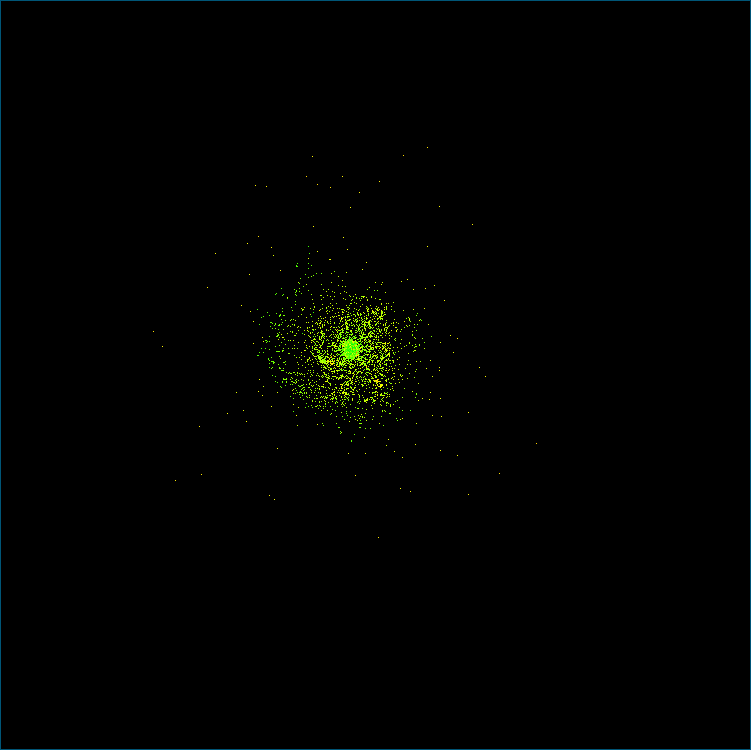

# nbody
This program calculates and displays the spatial motion of a system of
point masses bound by gravitational attraction.

## Overview
The equations of motion are solved by the leapfrog method with the
constant step of integration. The system of bodies is treated as a
collisionless system, where singularities are avoided with the aid of
the Plummer softening. The gravitational potential is computed
approximately by the Barnes-Hut octree method.

## Requirements
The program is written in the standard C99 and can be compiled on any
POSIX-compliant system. It uses plain Xlib for interactive graphics.
The program contains provisions for being built with OpenMP to
achieve some level of parallelism in the most time consuming part.

## Input
The initial state of the system is read from the standard input. Each
line specifies the position, velocity, and mass of a point:

    x1 y1 z1    v1_x v1_y v1_z    m1
    x2 y2 z2    v2_x v2_y v2_z    m2
    ...

## Output
The program draws points with colour representing the current velocity
of a point. Bluer colours mean higher speeds.

## Keyboard controls
key     | action
--------|-------
`q`     | Quit
`c`     | Check conservation laws and the virial theorem
`s`     | Show octree performance counters and memory statistics
`t`     | Toggle drawing of the traces left by points as they move
`e`     | Toggle drawing of the edges of octree nodes
`←` `→` | Decrease and increase the viewing angle φ by 15°
`↓` `↑` | Decrease and increase the viewing angle θ by 15°
`d`     | Dump the current state to `stderr` in the same format as input

## Configuration
Most parameters are set by the `#define` directives in the source code.
Each directive has a comment describing its meaning.

## Generation of initial values
To feed the program with initial values, two auxiliary programs are
supplied:

* `genpoints-sph.c`: generates various mass distributions with spherical symmetry
* `genpoints-disk.c`: generates a Kuzmin disk

These programs are configured with the `#define` directives and `const`
variables in the source (see the comments).

## Example
A structure with spiral arms evolved out of a Kuzmin disk:

This image is created with the same parameters of the simulation and the
disk as set currently in the source.

## License
The programs are in the public domain.
